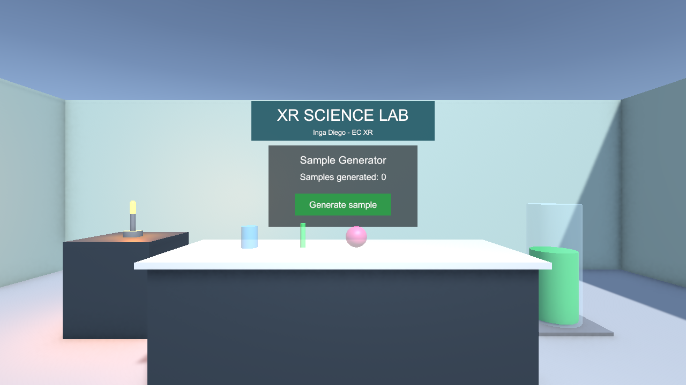
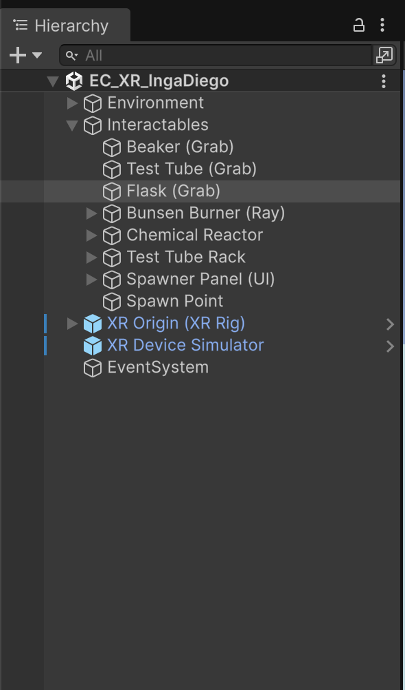
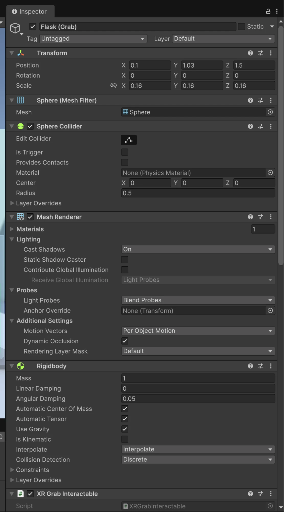
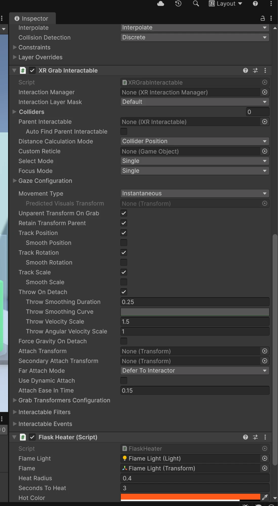
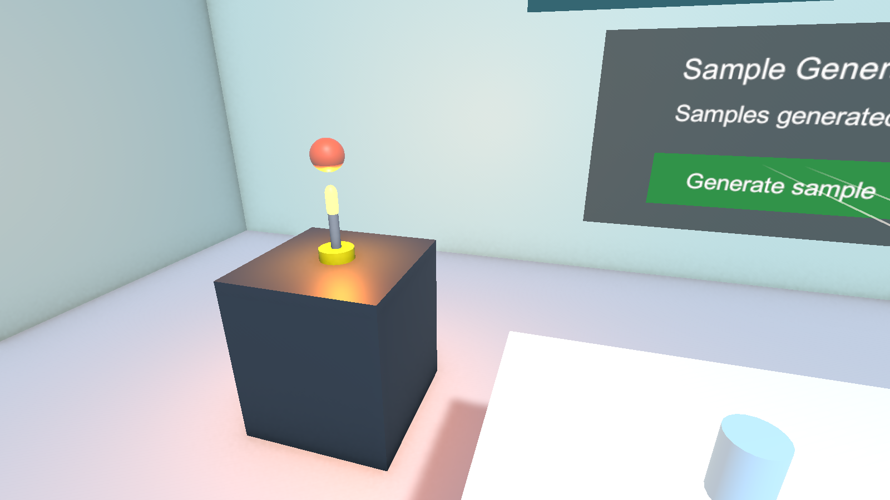
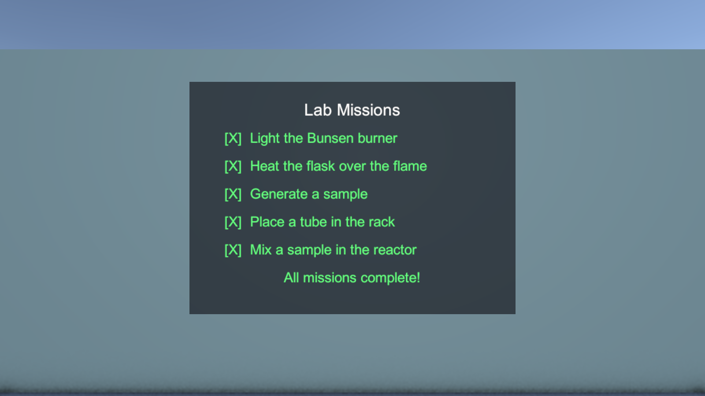

# XR Science Lab — EC_XR_IngaDiego

| Campo | Valor |
|---|---|
| Estudiante | Inga Diego |
| Código del estudiante | 2231891832 |
| Curso | Laboratorio de Realidad Extendida (XR) para Videojuegos |
| Docente | Victor Alejandro Arroyo Castro |

## Descripción

Laboratorio de ciencias en realidad virtual construido en Unity 6 con URP y XR Interaction Toolkit. El usuario recorre el laboratorio, manipula material de vidrio (vaso de precipitado, tubo de ensayo y matraz), enciende un mechero Bunsen y cambia el color del líquido de un reactor químico con el rayo, y usa un panel espacial que genera muestras y las contabiliza.

Escena principal: `Assets/Scenes/EC_XR_IngaDiego.unity`

## Funcionalidades implementadas

| Requerimiento | Implementación |
|---|---|
| Configuración XR | URP, XR Plug-in Management, OpenXR y XR Interaction Toolkit 3.6.1 (Starter Assets + XR Device Simulator) |
| Escenario | Piso, luz direccional, luz de la sala, cuatro paredes que delimitan el espacio, mesón de laboratorio, soporte del mechero, estante con frascos, armario de seguridad y cartel "XR SCIENCE LAB" (más de cinco objetos 3D) |
| Objetos manipulables | `Beaker`, `Test Tube` y `Flask` con `Rigidbody` y `XR Grab Interactable` |
| Interacción a distancia (Ray) | `Bunsen Burner`: enciende y apaga la llama y su luz. `Reactor Liquid`: cambia el color del líquido en cada selección |
| Reto libre | Panel de misiones en la pared que marca automáticamente 5 tareas (encender el mechero, calentar el matraz, generar una muestra, colocar un tubo en la gradilla y mezclar en el reactor); calentamiento: el matraz cambia de color al sostenerlo sobre la llama encendida; gradilla de tubos con tres `XR Socket Interactor` donde los tubos y muestras encajan al soltarlos; mezcla química: al dejar caer una muestra en el reactor, el líquido toma su color; UI espacial *Sample Generator* que genera muestras agarrables con contador, lanzamiento de objetos (`Throw On Detach`), teletransporte (`Teleportation Area`) y límite del área de juego dentro de las paredes (`PlayAreaLimiter`) |

## Controles

Con visor (OpenXR):

- **Grip**: tomar el material de vidrio o seleccionar con el rayo (mechero y reactor).
- **Soltar el grip en movimiento**: lanzar el objeto.
- **Gatillo sobre el panel**: presionar el botón *Generate sample*.
- **Joystick hacia adelante**: apuntar y soltar para teletransportarse.

En el editor con XR Device Simulator:

- **Clic derecho + mouse**: girar la cabeza. **W A S D**: caminar.
- **Mantener Left Shift / Espacio**: controlar el mando izquierdo o el derecho (ambos a la vez para los dos).
- Con un mando activo: **mouse** o **Q / E** lo mueven, **R** alterna entre mover y rotar el mando.
- **G**: grip (tomar o seleccionar con el rayo). **Clic izquierdo**: gatillo (botón de la UI).

## Capturas

1. Vista general del escenario

   

2. Configuración XR y componentes en el Inspector: jerarquía de la escena y el matraz con `Rigidbody`, `XR Grab Interactable` y `Flask Heater`

   
   
   

3. Interacción funcionando: mechero encendido con el rayo y matraz calentado sobre la llama

   

4. Panel de misiones con las cinco tareas completadas

   

## Video demostrativo

https://www.youtube.com/watch?v=UlvqgTRJrag

## Cómo abrir el proyecto

1. Clonar el repositorio.
2. Abrir la carpeta con Unity **6000.3.14f1**.
3. Abrir `Assets/Scenes/EC_XR_IngaDiego.unity` y presionar Play.
4. Opcional: el menú **EC XR > Build Scene** reconstruye la escena desde cero.

## Tecnologías y paquetes

- Unity 6000.3.14f1
- Universal Render Pipeline 17.3.0
- XR Interaction Toolkit 3.6.1
- XR Plug-in Management 4.6.1
- OpenXR Plugin 1.18.0
- Input System 1.19.0
- C# (scripts propios en `Assets/Scripts` y `Assets/Editor`)
